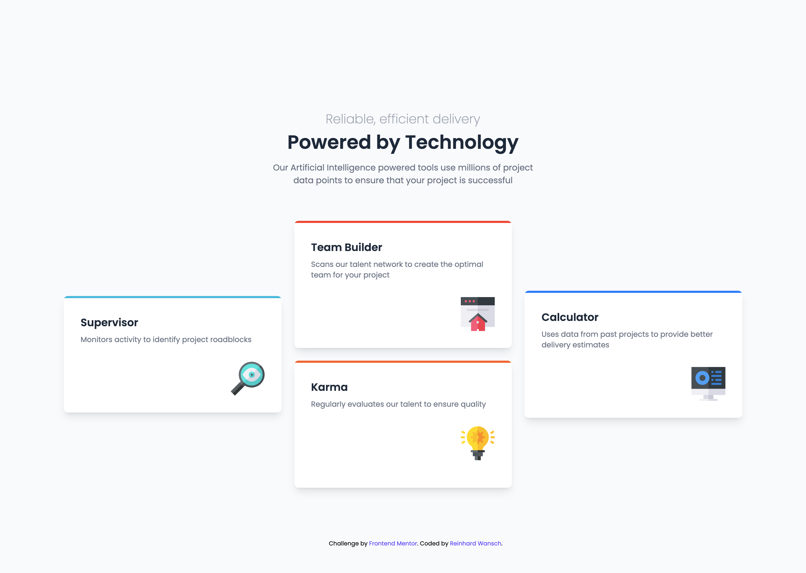

# Frontend Mentor - Four card feature section solution

This is a solution to the [Four card feature section challenge on Frontend Mentor](https://www.frontendmentor.io/challenges/four-card-feature-section-weK1eFYK). Frontend Mentor challenges help you improve your coding skills by building realistic projects. 

## Overview

I used TailwindCSS with postcss.

## Screenshot

## Links

- Solution URL: [Frontend Mentor]()
- Live Site URL: [github pages]()

## Built with

- TailwindCSS
- postcss

## What I learned

The following workflow has proven to be efficient and is suitable for learning:
- Show design images to an AI and have them analyzed
- Basic setup of the repo with the libraries and frameworks that you want to use and learn
- Have the entire code generated
- Have the parts that you don't understand explained and play around with them in another repo
- Make final adjustments and "submit"

## Useful resources

- [TailwindCSS](https://tailwindcss.com/docs/installation/using-postcss)
- [postcss](https://postcss.org/)
- [Claude](https://claude.ai/)

## Author

- Github - [ReinhardWansch](https://github.com/ReinhardWansch)
- Frontend Mentor - [@ReinhardWansch](https://www.frontendmentor.io/profile/ReinhardWansch)
